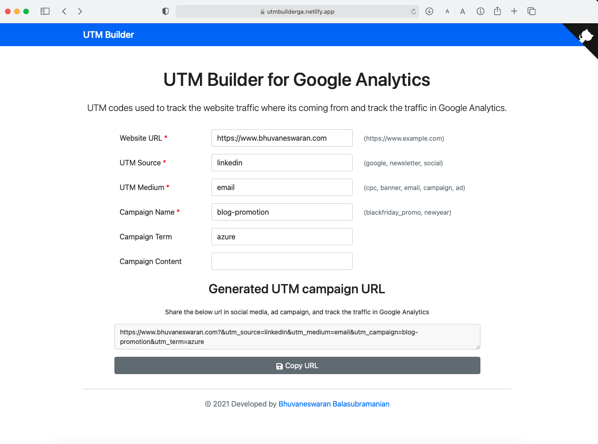

<h1 align="center">
  UTM Builder for Google Analytics
</h1>

<p align="center">

 
   <a href="https://app.netlify.com/sites/utmbuilderga/deploys"></a>
</p>

<p align="center">
   <a href="https://sonarcloud.io/dashboard?id=bhuvanbalasubramanian_utmbuilder"></a>
   <a href="https://sonarcloud.io/dashboard?id=bhuvanbalasubramanian_utmbuilder"></a>
      <a href="https://sonarcloud.io/dashboard?id=bhuvanbalasubramanian_utmbuilder"></a>

</p>

<div align="center">
    
</div>

## About

UTM codes used to track the website traffic where its coming from and it is tracked in Google Analytics. In a single click, you can generate the UTM urls and share it in campaign sites.

**[Demo](https://utmbuilderga.netlify.app)**

## Tech Stack

  - React
  - Gatsby
  - Javascript
  - HTML
  - CSS3

## Development

Clone and install 

```shell
git clone https://github.com/bhuvanbalasubramanian/utmbuilder.git

cd utmbuilder

npm install
```

Run a development server.

```shell
npm run develop
```

Build the project.

```shell
npm run build
```

## Author

- [Bhuvaneswaran Balasubramanian](https://www.bhuvaneswaran.com)

## License

This project is open source and available under the [MIT License](LICENSE).